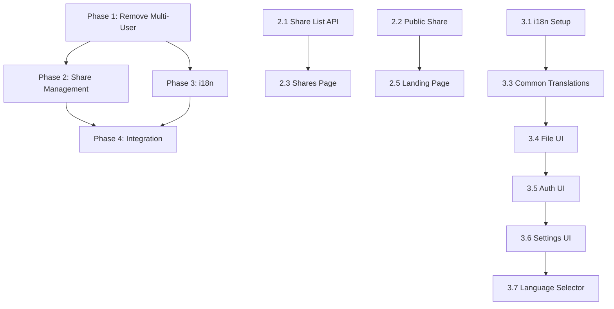

# Tasks: Simplify v1.0 Auth & Add Share Management & i18n

## Phase 1: Remove Multi-User Complexity
### Backend Changes

- [ ] **Task 1.1**: Remove signup API endpoint
  - Delete `routes/api/signup.post.go`
  - Remove signup route from `routes/router.go`
  - **Verification**: `POST /api/signup` returns 404

- [ ] **Task 1.2**: Update user initialization
  - Modify `cmd/root.go` to ensure admin always exists on startup
  - Add check: if admin doesn't exist, create with default credentials
  - **Verification**: Server starts with admin user available

### Frontend Changes

- [ ] **Task 1.3**: Remove signup page and routes
  - Delete `frontend/src/features/auth/pages/SignupPage.tsx`
  - Remove signup route from `frontend/src/routes.tsx`
  - Remove signup export from `frontend/src/features/auth/index.ts`
  - Remove signup link from login page
  - **Verification**: `/signup` returns 404, login page has no signup link

- [ ] **Task 1.4**: Clean up auth context
  - Remove `signup` method from `frontend/src/contexts/AuthContext.tsx`
  - Remove `email` field from User interface if only used for signup
  - **Verification**: Auth context compiles without signup functionality

- [ ] **Task 1.5**: Update API client
  - Remove signup call from `frontend/src/api/index.ts` if present
  - Remove signup-related error handling
  - **Verification**: API client has no signup references

---

## Phase 2: Share Management UI
### Backend Changes

- [ ] **Task 2.1**: Add share listing API endpoint
  - Create `routes/api/shares.get.go`
  - Implement GET `/api/shares` to return all active share links for user
  - **Verification**: `GET /api/shares` returns array of share links

- [ ] **Task 2.2**: Update public share endpoint for file serving
  - Enhance `routes/api/share.public.get.go` to serve actual file content
  - Add proper content-type headers based on file extension
  - Support both download and inline preview modes
  - **Verification**: Public share link serves correct file with proper headers

### Frontend Components

- [ ] **Task 2.3**: Create Shares management page
  - Create `frontend/src/features/settings/components/SharesPage.tsx`
  - Use MUI DataGrid for table display
  - Table columns: File Name, Created, Expires, Token, Actions
  - Add refresh button and loading state
  - **Verification**: Page displays table with share link data

- [ ] **Task 2.4**: Add share management actions
  - Implement copy token action
  - Implement revoke share action (with confirmation dialog)
  - Add view file action (opens file/folder)
  - Add filter/search functionality
  - **Verification**: All actions work correctly from table

- [ ] **Task 2.5**: Create public share landing page
  - Create `frontend/src/features/shares/PublicSharePage.tsx`
  - Display file preview or download button based on file type
  - Show share metadata (created date, expiration)
  - Add branding and footer
  - **Verification**: Public URL shows share interface without auth

- [ ] **Task 2.6**: Integrate shares into settings navigation
  - Add "Shares" submenu item to settings page
  - Add route for `/settings/shares`
  - Add breadcrumb navigation
  - **Verification**: Shares page accessible from settings menu

---

## Phase 3: Internationalization (i18n)
### Setup

- [ ] **Task 3.1**: Install and configure i18n
  - Add `react-i18next` and `i18next` to `frontend/package.json`
  - Create `frontend/src/i18n/config.ts`
  - Initialize i18next with supported languages (en, id)
  - Add i18n provider to `frontend/src/main.tsx`
  - **Verification**: App loads with i18n provider, no console errors

- [ ] **Task 3.2**: Create translation file structure
  - Create `frontend/src/i18n/locales/en/common.json`
  - Create `frontend/src/i18n/locales/id/common.json`
  - Create namespace structure (common, files, settings, auth)
  - **Verification**: Translation files compile without errors

### Core Translations

- [ ] **Task 3.3**: Translate common UI elements
  - Add translations for buttons, labels, errors
  - Cover: Save, Cancel, Delete, Download, Share, etc.
  - **Verification**: All common UI text has translation keys

- [ ] **Task 3.4**: Translate file management UI
  - Add translations for file list, grid view, context menu
  - Cover: Upload, Rename, Delete, Preview, Download
  - **Verification**: File management pages use translation keys

- [ ] **Task 3.5**: Translate authentication UI
  - Add translations for login page
  - Cover: Username, Password, Login button, error messages
  - **Verification**: Login page fully translated

- [ ] **Task 3.6**: Translate settings UI
  - Add translations for settings page, profile, shares
  - Cover: Language selector, change password, shares table
  - **Verification**: Settings page fully translated

### Language Switcher

- [ ] **Task 3.7**: Add language selector component
  - Create `frontend/src/components/common/LanguageSelector.tsx`
  - Use MUI Select or Dropdown component
  - Display language with flag or name
  - **Verification**: Component renders language options

- [ ] **Task 3.8**: Integrate language selector into settings
  - Add to profile settings section
  - Save language preference to localStorage/user settings
  - Apply language change immediately
  - **Verification**: Language switches on selection without page reload

- [ ] **Task 3.9**: Persist language preference
  - Add `language` field to user model if needed
  - Update settings API to save language preference
  - Load saved language on app initialization
  - **Verification**: Language preference persists across sessions

---

## Phase 4: Integration & Polish

### Integration

- [ ] **Task 4.1**: Update navigation and routing
  - Remove all references to signup in nav menus
  - Add shares management route to router
  - Add public share route (no auth required)
  - **Verification**: All routes work, no 404s

- [ ] **Task 4.2**: Update documentation
  - Update README to reflect single-user nature
  - Document admin credentials (admin/Admin123!)
  - Document how to change admin password
  - Document sharing feature
  - **Verification**: README accurately describes v1.0 features

- [ ] **Task 4.3**: Clean up unused code
  - Remove any remaining signup-related code
  - Remove unused multi-user imports
  - Clean up unused dependencies
  - **Verification**: Code compiles without warnings

### Testing

- [ ] **Task 4.4**: Test auth flow
  - Verify login works with admin credentials
  - Verify protected routes block unauthorized access
  - Verify token renewal works
  - **Verification**: All auth scenarios pass

- [ ] **Task 4.5**: Test share management
  - Create new share from file context menu
  - View share in management table
  - Revoke share from table
  - Test public share URL
  - **Verification**: All share operations work

- [ ] **Task 4.6**: Test language switching
  - Switch between English and Indonesian
  - Verify all UI text updates
  - Verify preference persists
  - Check for untranslated strings
  - **Verification**: i18n works end-to-end

- [ ] **Task 4.7**: Cross-browser testing
  - Test in Chrome, Firefox, Safari, Edge
  - Test responsive design on mobile
  - Verify table works on different screen sizes
  - **Verification**: UI works consistently across browsers

---

## Task Dependencies

## Parallelizable Work

**Can be done in parallel:**
- Task 1.3 (Frontend signup removal) + Task 1.1 (Backend signup removal)
- Task 2.3 (Shares page UI) + Task 2.1 (Share list API)
- Tasks 3.3, 3.4, 3.5, 3.6 (Translation files can be created simultaneously)
- Task 4.4, 4.5, 4.6 (Testing can be parallelized)

**Sequenced work:**
- Task 3.1 must complete before any translation work
- Task 2.1 must complete before Task 2.3
- Phase 4 requires Phases 1-3 to complete